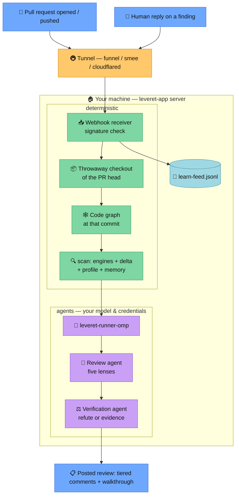

# Leveret as a GitHub App

Autonomous reviews: install once, every pull request gets reviewed. Start with
[Getting started](#getting-started); the [How it works](#how-it-works) section
explains the moving parts and has the diagram.

## Getting started

Prerequisites: Node 22+, git, the [reviewer toolbelt](../README.md#the-reviewer-toolbelt),
and [omp.sh](https://omp.sh) authenticated with your provider.

**1. Build:**

```sh
git clone https://github.com/andrebrait/leveret && cd leveret
npm install && npm run build
```

**2. Make the machine reachable for webhooks** (pick one):

Tailscale (recommended — stable URL, nothing else to run):

```sh
tailscale funnel --bg 8090
```

smee.io (quick test — needs the relay running):

```sh
npx -y smee-client -u https://smee.io/YOUR_CHANNEL -t http://127.0.0.1:8090/
```

cloudflared:

```sh
cloudflared tunnel --url http://127.0.0.1:8090
```

**3. Start the server** with the public URL from step 2:

```sh
LEVERET_PUBLIC_URL=https://YOUR-PUBLIC-URL \
LEVERET_RUNNER=leveret-runner-omp \
node dist/app/server.js
```

**4. Create your App:** open `https://YOUR-PUBLIC-URL/setup` in a browser (tunnels
proxy the whole server, setup page included). Only with smee — which relays
webhooks, nothing else — browse the server directly instead:
`http://SERVER-ADDRESS:8090/setup`, where SERVER-ADDRESS is `127.0.0.1` on the
machine itself or its LAN/VPN address from elsewhere. Click **Create the App on
GitHub**, confirm, then follow the install link and pick your repositories.
(Add `?org=NAME` to the setup URL for an organization-owned App.)

**5. Open a pull request.** Done — the review arrives as inline comments plus a
walkthrough summary.

Optional runner tuning (details in [How it works](#how-it-works)):

```sh
LEVERET_RUNNER="leveret-runner-omp --model gpt-5.6-sol --effort high"
```

## How it works



The pieces, top to bottom:

- **Webhook receiver.** GitHub sends every PR event to your public URL; the tunnel
  forwards it to the local server, which verifies the HMAC signature (the webhook
  secret from setup) and acknowledges immediately. Only two event types are
  subscribed: pull requests and replies on review comments.
- **Checkout, graph, scan.** The server clones the PR head into a temp directory,
  generates the code graph at exactly that commit (the graph is Leveret's own
  capability — the reviewed repo needs nothing), and runs the deterministic engines
  with delta scanning against the base: only findings the change introduced
  survive, with everything dropped accounted for.
- **The runner.** `leveret-runner-omp` drives two agent phases through a pinned
  omp.sh harness — the review agent (five lenses, cross-file blast radius via the
  graph) and the verification agent (tries to refute every concern; unverifiable
  claims are dropped, not published). Your provider credentials live only here;
  the App layer never sees them. Model, effort, and provider are yours to set —
  the review's walkthrough records what actually ran.
- **The review.** In-diff findings become inline comments grouped by tier;
  out-of-diff findings, reminders, coverage, and the engine table land in the
  walkthrough summary.
- **The learn feed.** Human replies on findings are captured raw to
  `learn-feed.jsonl` in the data dir; an agent session later ingests rulings into
  the repo's review memory via the `learn` tool.

Credentials on disk (`~/.leveret-app`, mode 0600): App ID, private key, webhook
secret — all owned by you, created by the setup flow, never leaving the machine.

### Manual App creation (alternative to /setup)

1. GitHub → Settings → Developer settings → GitHub Apps → New GitHub App.
2. Webhook URL: your public URL from step 2; set a webhook secret
   (`openssl rand -hex 32`).
3. Repository permissions: **Pull requests: Read & write**, **Contents: Read-only**.
   Events: **Pull request**, **Pull request review comment**.
4. Create, note the App ID, generate a private key, install on your repos.
5. Start the server with explicit credentials (env beats stored):

```sh
LEVERET_APP_ID=12345 \
LEVERET_PRIVATE_KEY_PATH=/path/to/app.pem \
LEVERET_WEBHOOK_SECRET=... \
LEVERET_RUNNER=leveret-runner-omp \
node dist/app/server.js
```

### Runner reference

`leveret-runner-omp` accepts CLI args (or `LEVERET_RUNNER_*` env vars; CLI wins):

| flag | env | default |
| --- | --- | --- |
| `--model` | `LEVERET_RUNNER_MODEL` | `gpt-5.6-sol` |
| `--effort` | `LEVERET_RUNNER_EFFORT` | `high` |
| `--provider` | `LEVERET_RUNNER_PROVIDER` | omp default |
| `--max-time` | `LEVERET_RUNNER_MAX_TIME` | `30m` per phase |
| `--omp-arg` (repeatable) | `LEVERET_RUNNER_OMP_ARGS` | — |

The purity flags (no skills, extensions, rules, sessions, or harness LSP;
compaction off) are fixed — they are the standardization. A custom
`LEVERET_RUNNER` command is the escape hatch for other harnesses; it receives
`LEVERET_REPO`, `LEVERET_BASE`, `LEVERET_LEADS`, `LEVERET_GRAPH` and must print
the verify-output JSON (see `agents/verify.md`).

Without any runner configured, reviews are deterministic-only: engine findings
post directly and the walkthrough says the agent lenses did not run.
