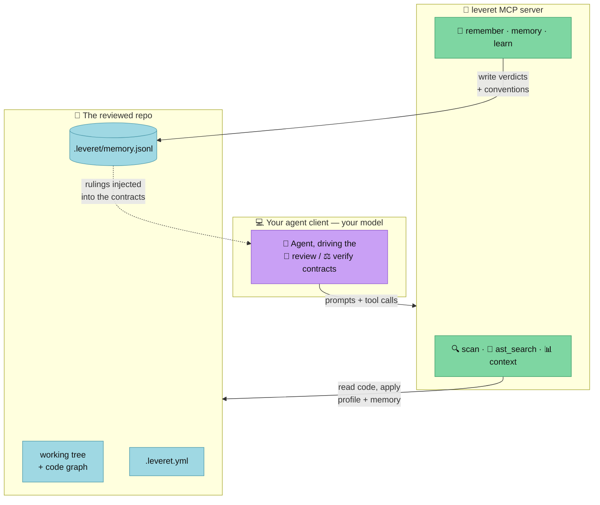

# Leveret in your own client (MCP)

Drive reviews yourself from any MCP-capable agent client. Start with
[Getting started](#getting-started); [How it works](#how-it-works) has the diagram.

## Getting started

Prerequisites: Node 22+ and the [reviewer toolbelt](../README.md#the-reviewer-toolbelt).

**1. Build and register:**

```sh
git clone https://github.com/leveret-dev/leveret && cd leveret
npm install && npm run build
claude mcp add leveret -- node "$PWD/dist/server.js"
```

**2. In your client, run a review** of the current branch of any repo:

```text
Use the leveret `review` prompt with repo=/path/to/repo base=origin/main,
then the `verify` prompt on its concerns.
```

**3. Teach it.** When you disagree with a finding — or want a house rule enforced:

```text
Call leveret.learn with the ruling and my handle as author.
```

## How it works



- The **prompts** (`review`, `verify`) are the agent contracts, served with your
  repo's accumulated rulings — conventions and fingerprint reasons — substituted
  in, so the agent reviews with the repo's case law.
- The **tools** are the deterministic layer: `scan` applies delta, profile, and
  memory before any lead reaches the agent; `ast_search` and `context` ground
  structural claims and prioritize attention; `remember` and `learn` write the
  verdicts and rulings back to the store, which is versioned in the repo.
- Your client supplies the model and the sandbox: probes the agent executes run
  under your normal tool permissions. This path is deliberately not standardized —
  you are present to judge.
